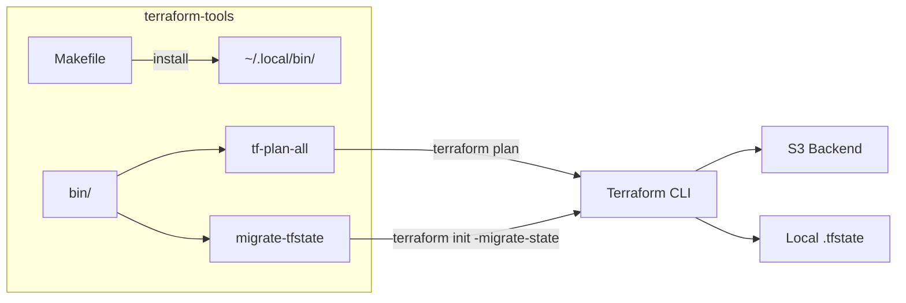

# terraform-tools — Architecture

## Overview

A lightweight CLI toolkit for Terraform operations across multi-module repositories. Provides two scripts — `tf-plan-all` for batch planning across directory trees and `migrate-tfstate` for migrating local state to S3 backends — installed via a single Makefile target.

## System Diagram

## Core Components

| Component | Purpose |
|-----------|---------|
| `bin/tf-plan-all` | Recursively discovers root Terraform modules and runs `terraform plan`, producing a status summary table and per-module logs |
| `bin/migrate-tfstate` | Generates `backend.tf` for S3 state storage and runs `terraform init -migrate-state` to move local state to a remote backend |
| `Makefile` | Installs scripts to `$INSTALL_DIR` (default `~/.local/bin`) with executable permissions |

## tf-plan-all

Walks a directory tree, identifies root modules (directories containing `.tf` files with `provider` blocks), runs `terraform plan` in each, and emits a Unicode status table. Logs are retained only for modules with changes or errors.

- **Shell**: zsh (uses `setopt nounset`, glob qualifiers, zsh arrays)
- **Output**: Timestamped logs under `<base>/tf-plan-logs/`

## migrate-tfstate

Adds an S3 backend configuration to a Terraform module and migrates its local state. Configurable via environment variables (`K8_TF_STATE_BUCKET`, `K8_AWS_REGION`, `K8_AWS_PROFILE`, `K8_TF_KMS_ALIAS`, `K8_TF_LOCK_TABLE`).

- **Shell**: bash (portable)
- **Modes**: `--dry-run` (preview only), `--upload` (auto-approve migration)

## Key Decisions

- **Two separate scripts, not a monolith**: Each tool has a distinct lifecycle — batch planning vs. one-time migration — so they stay independent
- **Makefile install pattern**: Matches the parent incubator's `compile/test/install` convention for uniform `make install` across utility repos
- **zsh for tf-plan-all**: Glob qualifiers (`**/*(/N)`) make recursive directory discovery concise; bash would require `find` piping
- **Environment-driven config for migrate-tfstate**: Avoids hardcoding AWS/S3 details; integrates with `.envrc` / Infisical secret injection
