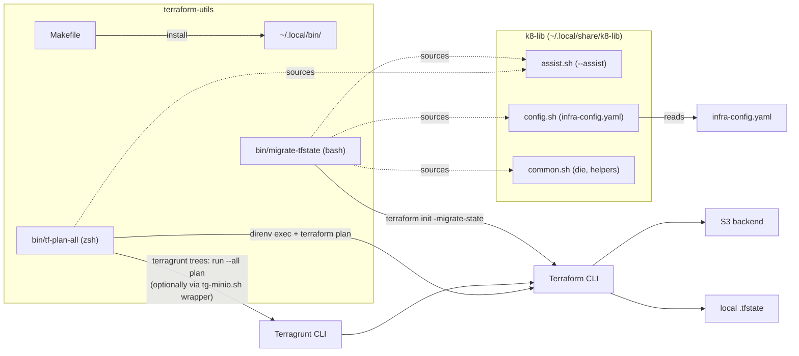

# terraform-utils — Architecture

## Overview

A lightweight terminal utility package for Terraform operations across multi-module repositories. It ships two scripts — `tf-plan-all` for batch planning across a directory tree and `migrate-tfstate` for migrating local `terraform.tfstate` files to an S3 backend — installed to `~/.local/bin` via `make install` (or the monorepo's `make install-utilities`).

Both tools are thin orchestrators around the Terraform CLI. They carry no persistent state of their own: `tf-plan-all` writes only runtime logs into the scanned tree, and `migrate-tfstate`'s only artifact is the `backend.tf` it generates inside the target module. Configuration and AI-assist behavior come from the shared `k8-lib` shell library, following the same conventions as every other utility in the Noizu utilities ecosystem.

## System Diagram

```mermaid
graph LR
    subgraph terraform-utils
        M[Makefile] -->|install| ID["~/.local/bin/"]
        TPA["bin/tf-plan-all (zsh)"]
        MTS["bin/migrate-tfstate (bash)"]
    end

    subgraph "k8-lib (~/.local/share/k8-lib)"
        A["assist.sh (--assist)"]
        C["config.sh (infra-config.yaml)"]
        CM["common.sh (die, helpers)"]
    end

    TPA -.->|sources| A
    MTS -.->|sources| A
    MTS -.->|sources| C
    MTS -.->|sources| CM
    C -->|reads| Y["infra-config.yaml"]

    TPA -->|"direnv exec + terraform plan"| TF["Terraform CLI"]
    TPA -->|"terragrunt trees: run --all plan<br/>(optionally via tg-minio.sh wrapper)"| TG["Terragrunt CLI"]
    TG --> TF
    MTS -->|"terraform init -migrate-state"| TF
    TF --> S3["S3 backend"]
    TF --> Local["local .tfstate"]
```

## Core Components

| Component | Purpose |
|-----------|---------|
| `bin/tf-plan-all` | Batch planning across a directory tree — auto-detects Terragrunt trees (delegates to `terragrunt run --all plan`, optionally through a `scripts/tg-minio.sh` MinIO wrapper) or walks plain Terraform root modules with `direnv exec`; emits a Unicode status table (No Changes / Has Changes / Error) and retains logs only for non-clean plans |
| `bin/migrate-tfstate` | Generates an S3 `backend.tf` for a module from k8-lib config and runs `terraform init -migrate-state` to move local state to the remote backend |
| `Makefile` | `install` copies both scripts to `$INSTALL_DIR` (default `~/.local/bin`) with exec permissions; `compile`/`test` are no-ops kept for the shared utilities convention |
| k8-lib (external) | Shared shell library sourced at runtime: `config.sh` (YAML config chain), `common.sh` (`die` and helpers), `assist.sh` (`--assist` AI help hook) |

→ *Components ↔ directories: see [PROJ-LAYOUT.md](PROJ-LAYOUT.md) — both tools live in `bin/`, installed by the root `Makefile`.*

## tf-plan-all

Two execution modes, chosen by probing the target tree:

- **Terragrunt trees** — if the base dir contains `terragrunt.hcl`, `root.hcl`, or any nested `terragrunt.hcl`, the script switches to Terragrunt: it searches upward from the base dir for an executable `scripts/tg-minio.sh` wrapper (e.g. the monorepo's MinIO port-forward shim) and `exec`s through it if found, otherwise runs `terragrunt --working-dir <base> run --all -- plan -input=false` directly. `--reconfigure` inserts a `run --all -- init -reconfigure` pass first. Terragrunt must be on PATH (exit 69 otherwise). In wrapper/delegation mode the per-module status table is skipped — Terragrunt's own aggregated output stands.
- **Plain Terraform/OpenTofu trees** — walks the tree (zsh `**/*(/N)` glob), treats a directory as a root module only if it contains `.tf` files with a `provider` block, and runs `direnv exec <dir> $TF_BIN -chdir=<dir> plan -input=false` in each — so per-directory `.envrc` credentials apply. Results are classified by exit code and "No changes." grep; clean-plan logs are deleted, non-clean logs kept under `<base>/tf-plan-logs/` with a run timestamp. `--verbose` adds per-plan timing and flags plans over 5 minutes as SLOW. Exit status is nonzero if any module errored.

## migrate-tfstate

Sources the full k8-lib chain (`config.sh`/`common.sh`/`assist.sh`), pre-parsing `--config <path>` before sourcing so an alternate `infra-config.yaml` takes effect. Backend settings resolve config-first with env overrides: `.terraform.state_bucket`/`K8_TF_STATE_BUCKET` (required), `.terraform.kms_alias`, `.terraform.lock_table` (default `terraform-lock`), `.aws.profile` (default `terraformer`), `.aws.region` (default `us-east-1`). The S3 key is derived from the module path with the leading `terraform/` stripped. An existing `backend.tf` is never overwritten. `--dry-run` previews; `--upload` pipes "yes" to auto-approve the migration.

## Ecosystem Fit

- Installed alongside all other Noizu DevOps utilities via the monorepo's `make install-utilities`; depends on k8-lib being installed at `~/.local/share/k8-lib` (overridable via `K8_LIB_DIR`).
- Follows the repo-wide `.infra-config.yaml`-as-source-of-truth convention through k8-lib's config loader (`yq`-based), with `K8_*` env vars layered on top.
- `--assist` on either tool routes to k8-lib's AI-powered help.
- In this monorepo the Terraform binary is typically OpenTofu via Terragrunt. `tf-plan-all` handles both worlds: it delegates to Terragrunt for `terragrunt.hcl`/`root.hcl` trees (including MinIO-backend wrapper delegation), and runs plain `terraform`/`tofu` (via `TF_BIN`) for ad-hoc/imported module trees. `migrate-tfstate` targets plain-terraform modules only.

## Key Decisions

- **Two separate scripts, not a monolith**: batch planning and one-time state migration have distinct lifecycles and shells; keeping them independent keeps each trivially auditable.
- **zsh for tf-plan-all, bash for migrate-tfstate**: zsh glob qualifiers make recursive root-module discovery a one-liner; the migration tool stays in portable bash since it needs no zsh features.
- **`direnv exec` per module in tf-plan-all**: honors per-directory `.envrc` (AWS creds, workspace vars) so one sweep can span modules with different credential contexts.
- **Config-first with env overrides in migrate-tfstate**: k8-lib resolves `infra-config.yaml` values, `K8_TF_*`/`K8_AWS_*` env vars win — no hardcoded AWS/S3 details, and CI or `.envrc` layers can override cleanly.
- **Keep-only-interesting-logs**: deleting clean-plan logs keeps `tf-plan-logs/` a signal of drift/errors rather than an archive.
- **Never overwrite `backend.tf`**: an existing backend block is assumed intentional; the tool warns and proceeds to migration only.
