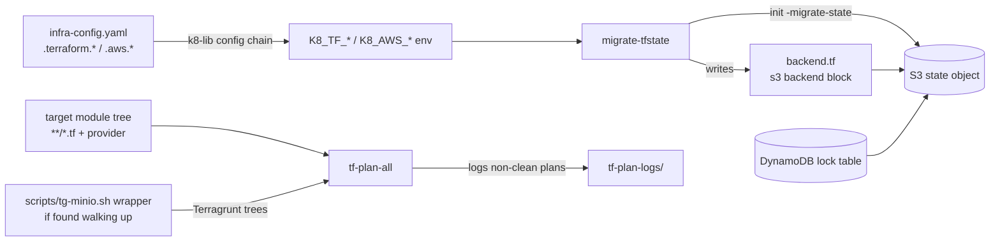

# Schema — terraform-utils

> **No persistence layer.** This package has **no database, no SQL schema, and no
> Liquibase changelogs**. There are no tables, ERDs, or migrations to document.
> What follows is the reference for the **configuration and data artifacts** the
> tools read, write, and produce: config file paths, env/secret variables, CLI
> flag grammar, generated Terraform backend config, and remote/local state file
> layout.

## Config Inputs

### `infra-config.yaml` (repo root of the *target* tree — external to this package)

Loaded by `migrate-tfstate` through the shared k8-lib config chain
(`~/.local/share/k8-lib/bin/config.sh`; override location with `K8_CONFIG` or
`--config <path>`).

| YAML Path | Env Override | Default | Required | Purpose |
|-----------|-------------|---------|----------|---------|
| `.terraform.state_bucket` | `K8_TF_STATE_BUCKET` | — | **Yes** (script dies without it) | S3 bucket for remote state |
| `.terraform.kms_alias` | `K8_TF_KMS_ALIAS` | — | No | KMS alias for state encryption (`kms_key_id`) |
| `.terraform.lock_table` | `K8_TF_LOCK_TABLE` | `terraform-lock` | No | DynamoDB state-lock table |
| `.aws.profile` | `K8_AWS_PROFILE` | `terraformer` | No | AWS CLI profile |
| `.aws.region` | `K8_AWS_REGION` | `us-east-1` | No | AWS region |

Env vars win over YAML (k8-lib precedence: `dc:` → `override:` → `auto:` → `default:`
for secret-backed values; see k8-lib docs).

### Environment Variables

| Variable | Tool | Default | Purpose |
|----------|------|---------|---------|
| `K8_LIB_DIR` | both | `~/.local/share/k8-lib` | Location of shared k8-lib (`config.sh`, `common.sh`, `assist.sh`) |
| `K8_CONFIG` | `migrate-tfstate` | k8-lib default chain | Alternative config file (also settable via `--config`) |
| `INFRA_ROOT` | `migrate-tfstate` | `$(pwd)` | Root of the infrastructure tree (unused downstream but exported) |
| `TF_BIN` | `tf-plan-all` | `terraform` | Terraform-compatible binary for plain trees (`tofu` for OpenTofu) |

### CLI Flag Grammar

```text
tf-plan-all      [--verbose|-v] [--reconfigure] [dir]
migrate-tfstate  [--dry-run] [--upload] [--config <path> | --config=<path>] <module-dir>
```

| Flag | Tool | Effect |
|------|------|--------|
| `--verbose`, `-v` | `tf-plan-all` | Per-plan progress, timing column, >5-min slow-plan warnings |
| `--reconfigure` | `tf-plan-all` | `init -reconfigure` before planning (stale backend cache, e.g. MinIO endpoint switch) |
| `--dry-run` | `migrate-tfstate` | Print planned `init -migrate-state` command; write `backend.tf` but do not migrate |
| `--upload` | `migrate-tfstate` | Auto-approve migration (pipes `yes`) |
| `--config <path>` / `--config=<path>` | `migrate-tfstate` | Alternative `infra-config.yaml` (exported as `K8_CONFIG` pre-parse) |

## Generated / Written Artifacts

### `backend.tf` (written by `migrate-tfstate` into the target module)

Skipped with a warning if the file already exists. Shape:

```hcl
terraform {
  backend "s3" {
    bucket         = "<K8_TF_STATE_BUCKET>"
    key            = "<module-path-without-leading-terraform/>/terraform.tfstate"
    region         = "<K8_AWS_REGION>"
    profile        = "<K8_AWS_PROFILE>"
    encrypt        = true
    kms_key_id     = "<K8_TF_KMS_ALIAS>"
    dynamodb_table = "<K8_TF_LOCK_TABLE>"
  }
}
```

**S3 key derivation**: the module path with a leading `terraform/` stripped,
plus `/terraform.tfstate` — e.g. `terraform/production/services/eks` →
`production/services/eks/terraform.tfstate`.

**Precondition**: the module must already contain a local `terraform.tfstate`,
and the state-bucket stack (`terraform/production/state`) must be applied first.

### `tf-plan-logs/` (runtime output of `tf-plan-all`)

- Created inside the scanned base directory; **not part of this package**.
- One log per non-clean module: `<timestamp>-<relative-module-path>.log`
  (timestamp format `YYYYMMDD-HHMMSS`).
- Clean ("No changes.") logs are deleted immediately; only Has Changes / Error
  logs are retained.
- The directory itself is excluded from scanning.

### Remote State (consumed, not created here)

- S3 objects at `s3://<state_bucket>/<derived-key>` — encrypted, KMS where alias set.
- DynamoDB table `terraform-lock` (default) for state locking.

## Artifact Relationship Map



## Maintenance Checklist

- [ ] Config table matches flags/defaults read in `bin/migrate-tfstate`
- [ ] Flag grammar matches `bin/tf-plan-all` / `bin/migrate-tfstate` usage lines
- [ ] `backend.tf` template matches the heredoc in `migrate-tfstate`
- [ ] Still no DB/SQL persistence layer (if one appears, replace this doc with real ERDs)
