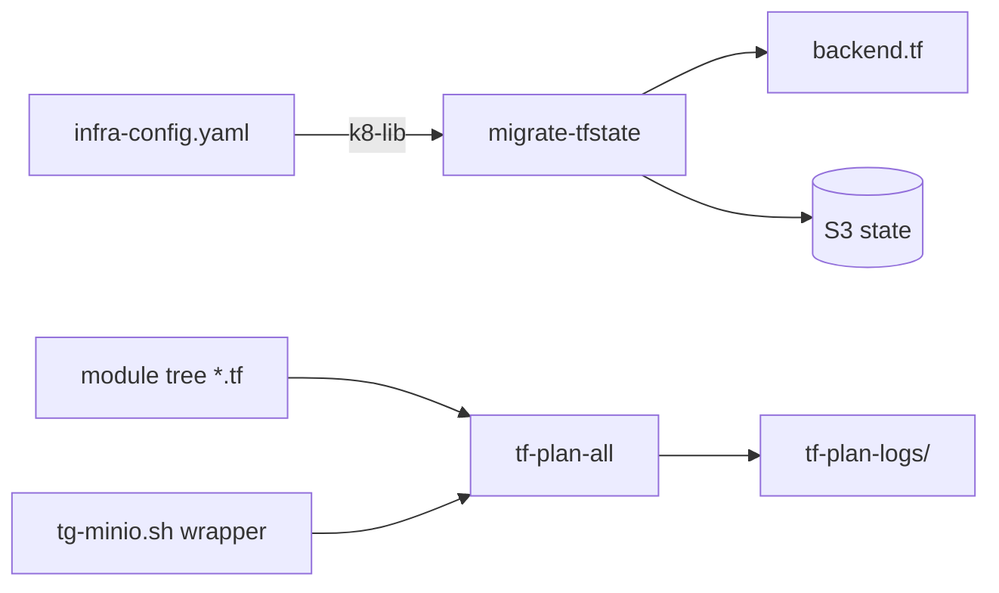

# Schema Summary — terraform-utils

> **No persistence layer** — no database, SQL schema, or migrations. This summary
> covers config inputs, env vars, CLI flags, and generated/state artifacts.

## Config Inputs

| Source | Keys / Vars | Consumer |
|--------|-------------|----------|
| `infra-config.yaml` | `.terraform.state_bucket` (req), `.terraform.kms_alias`, `.terraform.lock_table` (default `terraform-lock`), `.aws.profile` (default `terraformer`), `.aws.region` (default `us-east-1`) | `migrate-tfstate` via k8-lib |
| Env | `K8_TF_STATE_BUCKET`, `K8_TF_KMS_ALIAS`, `K8_TF_LOCK_TABLE`, `K8_AWS_PROFILE`, `K8_AWS_REGION`, `K8_LIB_DIR`, `K8_CONFIG`, `INFRA_ROOT`, `TF_BIN` | both tools |

## CLI Flags

| Tool | Grammar |
|------|---------|
| `tf-plan-all` | `[--verbose\|-v] [--reconfigure] [dir]` |
| `migrate-tfstate` | `[--dry-run] [--upload] [--config <path>] <module-dir>` |

## Artifacts

| Artifact | Writer | Notes |
|----------|--------|-------|
| `backend.tf` | `migrate-tfstate` | s3 backend block; skipped if exists; key = module path minus leading `terraform/` + `/terraform.tfstate` |
| `tf-plan-logs/<ts>-<module>.log` | `tf-plan-all` | non-clean plans only; clean logs deleted; dir excluded from scanning |
| `s3://<bucket>/<key>` state | terraform (migrated) | KMS-encrypted; DynamoDB `terraform-lock` for locks |

